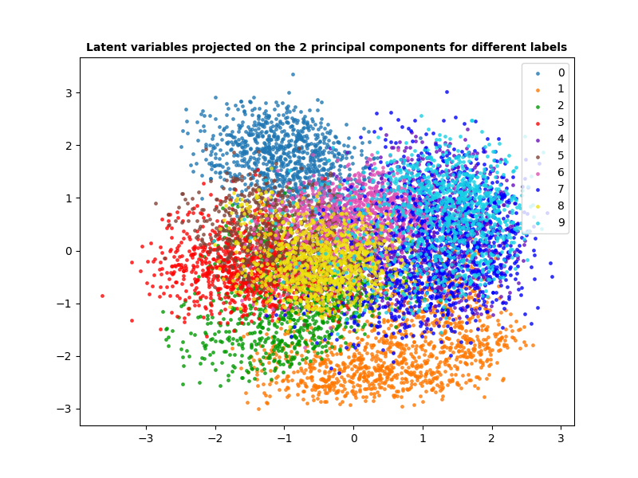

# Advanced ML : Programming Exercises - Week 1

## Exercise 1.4

> In this first exercise, you should just inspect the code in vae_bernoulli.py.
Answer the following questions:

>* How is the reparametrisation trick handled in the code?

The reparametrisation trick is handled when sampling z from the distribution $q(x| \phi )$ only noted $q$ in the code and learned using Gaussian encoder class.  
This sampling is done in the $elbo$ function within the $VAE$ class


``` 
def elbo(self, x):
    ...
    q = self.encoder(x)
    z = q.rsample() 
    ...
    return elbo
```


>* Consider the implementation of the ELBO.  
What is the dimension of `self.decoder(
z).log_prob(x)` and of `td.kl_divergence(q, self.prior.distribution)`?

* `self.decoder(z).log_prob(x)` is of dimension $B$, the batch size = number of images = $128$. It is the log product Bernouilli likelihood.
* `td.kl_divergence(q, self.prior.distribution)` is of the same dimension. It is the KL divergence between the latent distribution $q$ and the prior standard Gaussian distribution $p(z)$.

>* The implementation of the prior, encoder and decoder classes all make use of
td.Independent. What does this do?

`td.Independant` enables to consider every image of the batch as a unique event. This allows to compute directly the log likelihood of the whole image using `.log_prob(x)` instead of considering every pixel independantly.

>* What is the purpose using the function torch.chunk in GaussianEncoder.forward?

`torch.chunk(self.encoder_net(x), 2, dim=-1)` enables to split the encoded input x into two chunks over the last dimension (columns)
in order to have a column of $means$ and a columns of $\log(stds)$ for the approximated latent distribution $q$.

## Exercise 1.5

> Add the following functionally to the implementation (vae_bernoulli.py) of
the VAE with Bernoulli output distributions:

> * Evaluate the ELBO on the binarised MNIST test set.

In order to evaluate the ELBO on the MINST dataset, we added another possible argument for the `mode` mandatory argument : `evaluate`:

```
if args.mode == 'train':
    ...

elif args.mode == 'sample':
    ...

elif args.mode == 'evaluate' :
    model.load_state_dict(torch.load(args.model, map_location=torch.device(args.device)))
    model.eval()
    
    total_elbo = 0
    num_batches = 0
    
    print("Calcul de l'ELBO sur le dataset de test...")
    with torch.no_grad():
        for x, _ in mnist_test_loader:
            x = x.to(device)
            # We use directly elbo to have a positive value
            batch_elbo = model.elbo(x)
            total_elbo += batch_elbo.item()
            num_batches += 1
    
    mean_elbo = total_elbo / num_batches # Mean over all batches
    print(f"ELBO moyen sur le dataset MNIST test : {mean_elbo:.4f}")
```

In the end we end up with a value of $\approx 95$ for the elbo MNIST test set.


> * Plot samples from the approximate posterior and colour them by their correct class
label for each datapoint in the test set (i.e., samples from the aggregate posterior).
Implement it such that you, for latent dimensions larger than two, M > 2, do
PCA and project the sample onto the first two principal components (e.g., using
scikit-learn).

For this part we added the method `aggregated_posterior_sample` to the class `VAE` : 
```
 def aggregated_posterior_sample(self, batch_x):
        # Aggregate posterior from this datapoint :
        q = self.encoder(batch_x)
        # Sample from the aggregate posterior, no need for reparametrisation trick here since we are not doing backpropagation 
        z = q.sample()
        
        return z # z Batch-size tensor of latent data, every data point is represented by a latent vector z sampled from an independant distribution thanks to td.Independant
```
And we added the possible argument `"color-map"` for the mode in the parser. If this new mode is chosen, the following code activates :

``` 
elif args.mode == "color-map" :
        # Loading mnist test-set
        model.load_state_dict(torch.load(args.model, map_location=torch.device(args.device)))
        model.eval()

        Latent_variables = []
        Labels = []
        for batch_x, batch_label in mnist_test_loader :
            if batch_label.shape == torch.Size([128]) :
                # Sample from aggregated posterior
                batch_x = batch_x.to(device)
                z = model.aggregated_posterior_sample(batch_x)
                Latent_variables.append(z)
                Labels.append(batch_label)
        
        Labels = torch.flatten(torch.stack(Labels)).numpy()
        Latent_variables = torch.flatten(torch.stack(Latent_variables),end_dim=-2)

        # Perform PCA on the latent variables
        pca = PCA(n_components=2)
        Latent_variables = Latent_variables.cpu().numpy()
        pca.fit(Latent_variables)

        # Project the latent variables on the pca space
        transformed_latent = pca.transform(Latent_variables) 

        # Explained variance
        print("Explained variance from the pca on the latent variables : ", pca.explained_variance_ratio_)

        color_mapping(transformed_latent, Labels)
```

Where `color_mapping` enables to plot the latent variables projected on the latent space with different color for every label.

The command `vae_bernoulli.py color-map --device mps --latent-dim 10 --model model.pt --batch-size 128` leads to the following figure :



## Exercise 1.6


